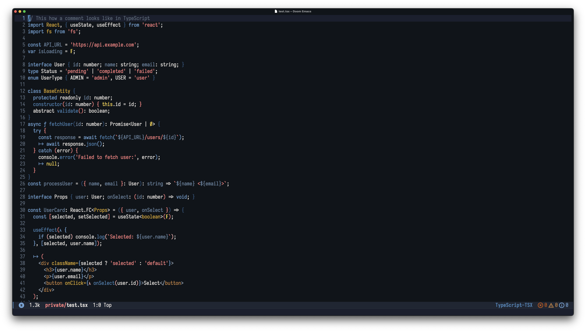
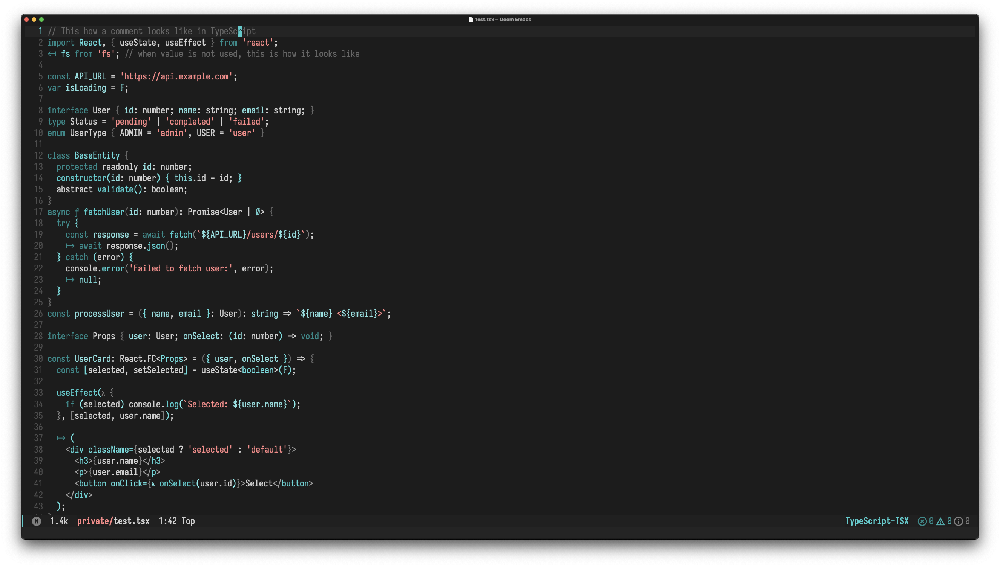
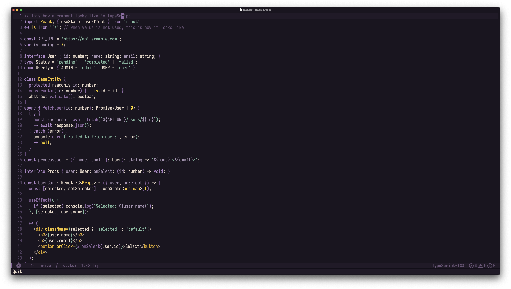
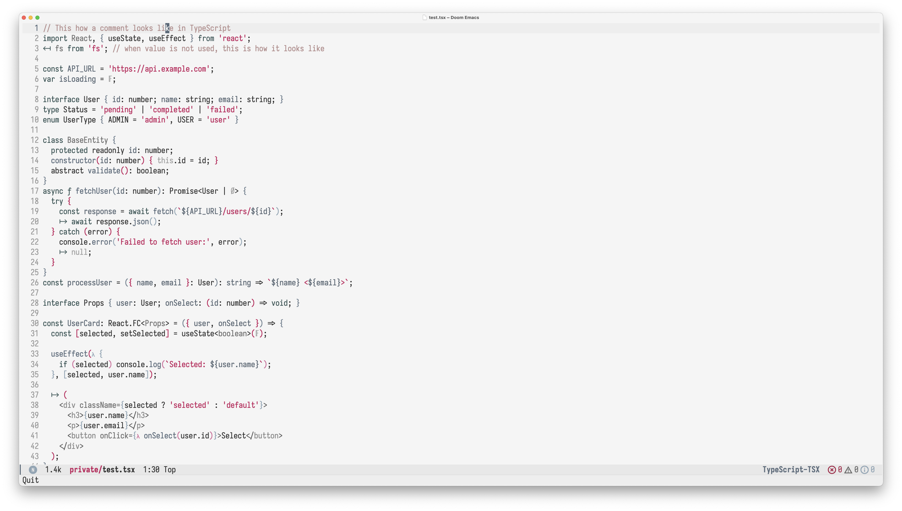

# doom-two-tone-themes

A sophisticated collection of two-tone themes for **Doom Emacs**, each following a carefully crafted color philosophy: **two main complementary colors for syntax highlighting** plus **one accent color for strings and comments**.

> **Note**: These themes are specifically designed and tested for Doom Emacs. While they may work with vanilla Emacs, they have not been thoroughly tested outside of the Doom Emacs environment.

## Installation

### Doom Emacs (Recommended)

For Doom Emacs users, add the following to your `packages.el` file:

```elisp
(package! doom-two-tone-themes
  :recipe (:host github
           :repo "eliraz-refael/doom-two-tone-themes"
           :files ("doom-two-tone-themes.el" "themes/*.el")))
```

Then run `doom sync` in your terminal, and restart Emacs.

### Configuration

Add this line to your `config.el` to make the themes available:

```elisp
(require 'doom-two-tone-themes)
```

### Usage

Once installed, you can use the themes in several ways:

#### Method 1: Interactive Theme Selection
- Use `SPC h t` (or `M-x consult-theme`) to interactively browse and preview all available themes
- All doom-two-tone themes will appear in the list with their full names

#### Method 2: Load Specific Theme
Load a specific theme directly in your `config.el`:

```elisp
(setq doom-theme 'doom-ocean-gold)
```

Or load it interactively:

```elisp
M-x load-theme RET doom-ocean-gold RET
```

#### Method 3: Random Theme Functions
The package includes several convenience functions:

```elisp
;; Load a random theme from the collection
M-x doom-two-tone-themes-load-random

;; Load a random dark theme
M-x doom-two-tone-themes-load-random-dark

;; Load a random light theme
M-x doom-two-tone-themes-load-random-light

;; List all available themes with descriptions
M-x doom-two-tone-themes-list-themes
```

### Manual Installation (Alternative)

If you prefer manual installation:

1. Clone this repository:
   ```bash
   git clone https://github.com/eliraz-refael/doom-two-tone-themes.git
   ```

2. Add the themes directory to your `custom-theme-load-path`:
   ```elisp
   (add-to-list 'custom-theme-load-path "/path/to/doom-two-tone-themes/")
   (require 'doom-two-tone-themes)
   ```

## Philosophy

Each theme in this collection is built around the principle of visual harmony through constraint. By limiting the palette to two primary colors plus one accent, these themes achieve:

- **Visual coherence** - Everything feels unified and intentional
- **Reduced cognitive load** - Less visual noise means better focus
- **Professional aesthetics** - Sophisticated color relationships
- **Enhanced readability** - Careful contrast ratios for long coding sessions

## Collection Status

**Current**: 12 themes (6 dark + 6 light)  
**Planned**: 8 additional themes coming soon for a total of 20 sophisticated two-tone themes!

## Themes

### Dark Themes

#### doom-navy-copper
*Navy blue and copper with coral accents*

A sophisticated dark theme combining deep navy blues with warm copper tones, accented by vibrant coral for strings. Perfect for a professional, nautical-inspired coding environment.



#### doom-silver-slate
*Silver and slate with seafoam teal accents*

An elegant monotone theme using silver and blue-gray tones with seafoam teal accents. Creates a "brushed metal" aesthetic that's both modern and calming.


#### doom-cyan-charcoal
*Cyan and charcoal with coral accents*

A sleek dark theme pairing bright cyan with deep charcoal grays, creating a high-tech, futuristic coding environment with vibrant coral strings.



#### doom-purple-gold
*Purple and gold with mint green accents*

A rich, royal theme combining deep purples with golden highlights and mint green strings, perfect for those who appreciate luxury aesthetics in their editor.



#### doom-orange-grey
*Orange and grey with complementary accents*

A minimalist dark theme using warm orange tones with cool grays, creating a balanced and readable coding environment.


#### doom-burgundy-rose
*Burgundy and rose gold with soft pink accents*

A luxurious dark theme using deep burgundy and elegant rose gold with soft pink strings. Sophisticated and rich, like coding in an upscale wine bar.


### Light Themes

#### doom-pink-sunshine
*Deep pink and sunshine yellow with electric blue accents*

A bold, energetic light theme combining vibrant deep pink with sunshine yellow, accented by electric blue strings. Pop-art inspired and full of personality.


#### doom-slate-mushroom
*Slate blue and mushroom gray with rose gold accents*

A sophisticated light monotone theme using slate blue and mushroom gray with rose gold accents. Professional and elegant, like a premium business interface.



#### doom-ocean-gold
*Blue-green and blue-silver with coral accents*

A refreshing light theme combining oceanic blue-greens with blue-silver tones, accented by coral highlights. Like coding by the seaside.


#### doom-teal-terracotta
*Teal and terracotta with lavender accents*

A warm, earthy light theme pairing deep teal with terracotta browns, softened by lavender string accents. Natural and inviting.


#### doom-dusty-steel
*Dusty blue and steel blue with golden yellow accents*

A calming light theme using dusty blue and steel blue tones with golden yellow accents. Eye-friendly blues with warm golden highlights for comfortable long coding sessions.


#### doom-warm-charcoal
*Warm gray and charcoal with teal accents*

A sophisticated monotone light theme using warm gray and charcoal tones with vibrant teal accents. Professional and elegant, perfect for minimalist aesthetics.


## Contributing

Contributions are welcome! If you have suggestions for new color combinations or improvements to existing themes, please feel free to open an issue or submit a pull request.

## License

This project is licensed under the GPL-3.0 License - see the LICENSE file for details.

# Acknowledgments

- Built on the excellent doom-themes framework
- Inspired by the philosophy of constraint-based design
- Thanks to the Doom Emacs community for their continued support and feedback
- Special thanks to community contributors who helped improve this package:

- @gusgustavsohn - for providing installation instructions and package configuration
- @ScriptMang - for valuable feedback and suggestions
