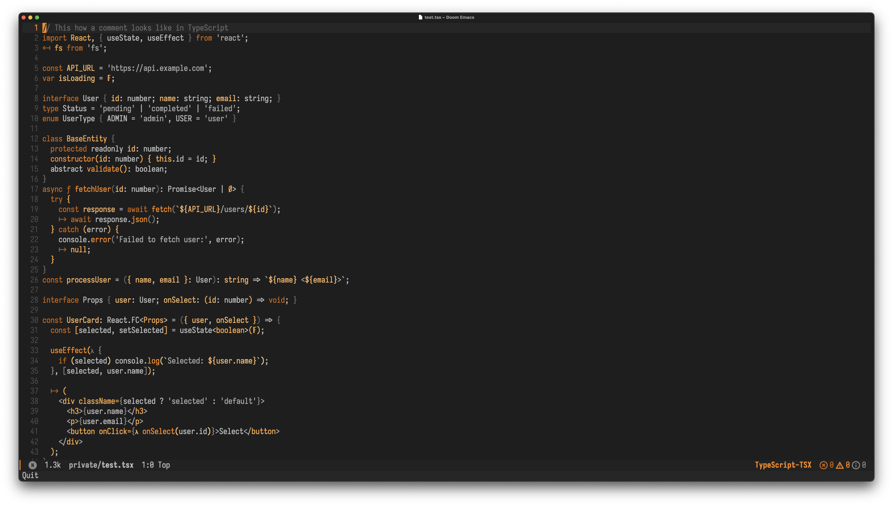
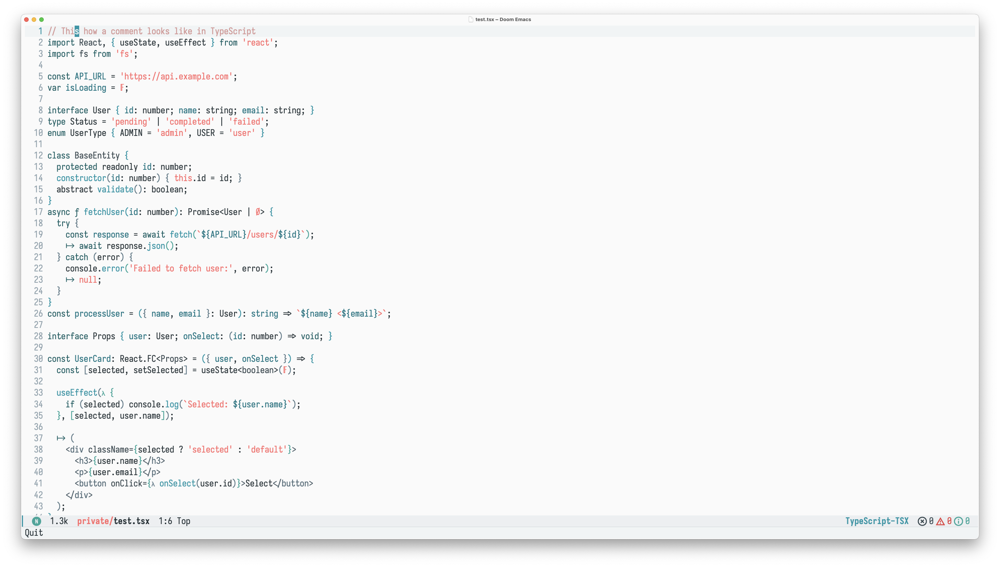
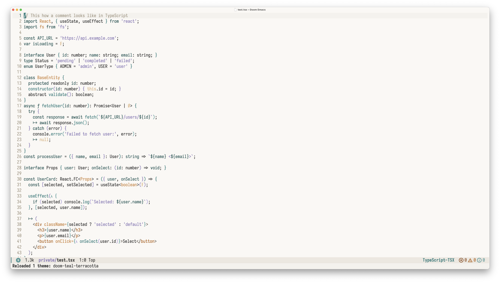

# doom-two-tone-themes

A sophisticated collection of two-tone themes for Doom Emacs, each following a carefully crafted color philosophy: **two main complementary colors for syntax highlighting** plus **one accent color for strings and comments**.

## Philosophy

Each theme in this collection is built around the principle of visual harmony through constraint. By limiting the palette to two primary colors plus one accent, these themes achieve:

- **Visual coherence** - Everything feels unified and intentional
- **Reduced cognitive load** - Less visual noise means better focus
- **Professional esthetics** - Sophisticated color relationships
- **Enhanced readability** - Careful contrast ratios for long coding sessions

## Themes

### Dark Themes

#### doom-silver-slate
*Silver and slate with seafoam teal accents*

An elegant monotone theme using silver and blue-gray tones with seafoam teal accents. Creates a "brushed metal" aesthetic that's both modern and calming.


#### doom-orange-grey
*Orange and grey with complementary accents*

A balanced light theme using warm orange tones with cool grays, creating a harmonious and readable coding environment.



#### doom-navy-copper
*Navy blue and copper with coral accents*

A sophisticated dark theme combining deep navy blues with warm copper tones, accented by vibrant coral for strings. Perfect for a professional, nautical-inspired coding environment.


#### doom-cyan-charcoal
*Cyan and charcoal with vibrant accents*

A sleek dark theme pairing bright cyan with deep charcoal grays, creating a high-tech, futuristic coding environment.


#### doom-purple-gold
*Purple and gold with elegant accents*

A rich, royal theme combining deep purples with golden highlights, perfect for those who appreciate luxury aesthetics in their editor.


### Light Themes

#### doom-pink-sunshine
*Deep pink and sunshine yellow with electric blue accents*

A bold, energetic light theme combining vibrant deep pink with sunshine yellow, accented by electric blue strings. Pop-art inspired and full of personality.


#### doom-slate-mushroom
*Slate blue and mushroom gray with rose gold accents*

A sophisticated light monotone theme using slate blue and mushroom gray with rose gold accents. Professional and elegant, like a premium business interface.


#### doom-ocean-gold
*Blue-green and blue-silver with golden accents*

A refreshing light theme combining oceanic blue-greens with blue-silver tones, accented by golden highlights. Like coding by the seaside.



#### doom-teal-terracotta
*Teal and terracotta with lavender accents*

A warm, earthy light theme pairing deep teal with terracotta browns, softened by lavender string accents. Natural and inviting.




## Installation

### Via MELPA (Recommended)

```elisp
;; Add to your init.el or config.el
(use-package doom-two-tone-themes
  :ensure t
  :config
  ;; Load your preferred theme
  (load-theme 'doom-navy-copper t))
```

### Manual Installation

1. Clone this repository:
```bash
git clone https://github.com/your-username/doom-two-tone-themes.git
```

2. Add to your Emacs configuration:
```elisp
;; Add the theme directory to your load path
(add-to-list 'custom-theme-load-path "/path/to/doom-two-tone-themes/themes/")

;; Load your preferred theme
(load-theme 'doom-navy-copper t)
```

### Doom Emacs Users

Add to your `config.el`:
```elisp
;; Set your preferred theme
(setq doom-theme 'doom-navy-copper)
```

## Usage

### Load a Specific Theme
```elisp
(load-theme 'doom-navy-copper t)      ; Dark nautical theme
(load-theme 'doom-pink-sunshine t)    ; Vibrant light theme  
(load-theme 'doom-silver-slate t)     ; Elegant monotone theme
```

### Convenience Functions

The package provides helpful interactive functions:

```elisp
M-x doom-two-tone-themes-list-themes     ; Browse all available themes
M-x doom-two-tone-themes-load-random     ; Load a random theme
M-x doom-two-tone-themes-load-random-dark ; Load a random dark theme
M-x doom-two-tone-themes-load-random-light ; Load a random light theme
```

### Theme Categories

**Dark Themes**: `doom-navy-copper`, `doom-silver-slate`, `doom-cyan-charcoal`, `doom-purple-gold`, `doom-orage-grey`

**Light Themes**: `doom-pink-sunshine`, `doom-slate-mushroom`, `doom-ocean-gold`, `doom-teal-terracotta`

## Customization

All themes support the standard doom-themes customization options:

```elisp
(setq doom-themes-enable-bold t        ; Enable bold fonts
      doom-themes-enable-italic t      ; Enable italic fonts
      doom-themes-padded-modeline 4)   ; Add padding to modeline
```

Each theme also includes specific customization variables for brighter comments, modeline styling, and more.

## Requirements

- Emacs 25.1+
- [doom-themes](https://github.com/doomemacs/themes) 2.2.1+

## Philosophy Behind the Design

These themes are inspired by the principle that **constraint breeds creativity**. By limiting each theme to just two main colors plus one accent:

1. **Every color choice is intentional** - No random or arbitrary colors
2. **Visual hierarchy is clear** - Important elements stand out naturally  
3. **Cognitive load is reduced** - Your brain can focus on code, not colors
4. **Aesthetic coherence emerges** - Everything feels unified and professional

Each theme tells a visual story through its color relationships, whether it's the nautical inspiration of navy-copper or the pop-art energy of pink-sunshine.

## Contributing

Found a bug or have a suggestion? Please open an issue or submit a pull request!

## License

MIT License - see [LICENSE](LICENSE) file for details.

## Author

Created by [Eliraz Kedmi](https://github.com/your-username)

---

*Enjoy coding with intentional, beautiful colors!* ✨
